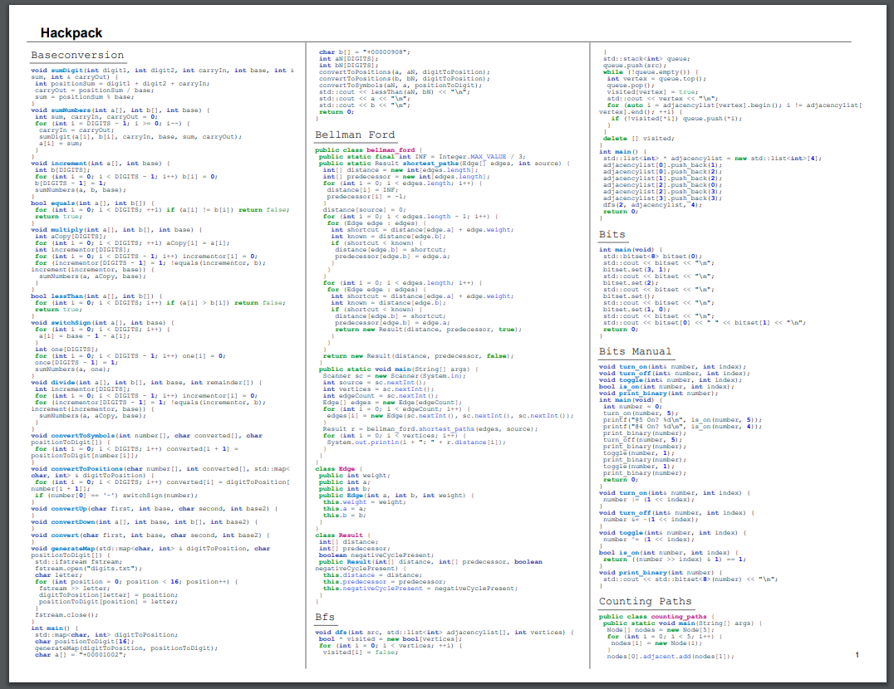

# Hackpack
**Generates a "hackpack" for competitive programmers**

# Disclaimer

This software is in alpha. Use with a salt of caution.

## Quick Start

Download the Windows executable from releases. Move this file somewhere that is seen by the PATH system variable. 
Then simply execute 
```sh
hackpack
``` 
from the root of a project, and a .pdf will automatically be generated.

## Command line arguments 

The path to the settings file and the path to the output file can be changed with the flags *--config* and *--output*, respectively.
Neither of these paths should include a file extension.
More options can be found by `hackpack --help`.
```sh
hackpack --config=hackpack/config --output=hackpack/hackpack
```

## Configuration

To see what options are available, generate a default config file with 
```sh
hackpack --init
``` 
(run from the root of a project). Comments should explain each one.
Not every option must be overriden; ones that are not mentioned in the .toml file are given their default values.

## Example configuration
```toml
# Will be printed at the top of each page
title = "Hackpack"

# Style the lexer will use to do syntax highlighting
# Styles & lexer are provided by https://github.com/alecthomas/chroma
# You can test out styles at https://swapoff.org/chroma/playground/
# ==========================================================
# abap, algol, algol_nu, arduino, autumn, borland, bw, colorful,
# dracula, emacs, friendly, fruity, github, igor, lovelace, manni,
# monokai, monokailight, murphy, native, paraiso-dark, paraiso-light,
# pastie, perldoc, pygments, rainbow_dash, rrt, solarized-dark, 
# solarized-dark256, solarized-light, swapoff, tango, trac, vim,
# vs, xcode
theme = "colorful"


[source]

# The root directories of the source files
roots = [
	"."
]

# Golang-style regexes of files to ignore. Regexes can be tested on https://regex101.com/
# ======================================================================================
# Generally settings files and testing files should be ignored
ignore = [
	'.*?\.xml',
	'.*?\.json',
	'.*?\.toml'
]

[page_layout]

# Type of paper this will be printed on
# Pdf generation framwork is provided by https://github.com/jung-kurt/gofpdf
# =========================================================================
# Letter, A4
page = "Letter"

# Number of columns the the document is split into. This will affect both the main body and the index
columns = 3

# Settings that affect the size of the text in different areas of the document
# These are in mm
code_font_size = 6.0
header_font_size = 10.0
index_font_size = 8.0
```

# Example output



